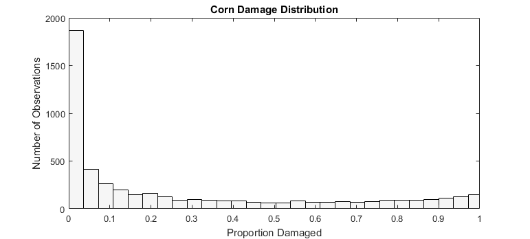
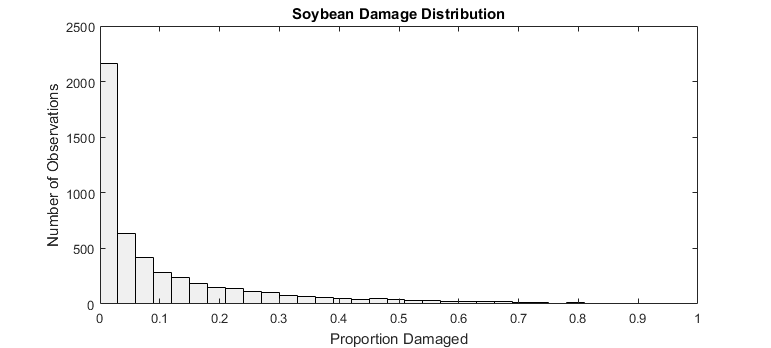
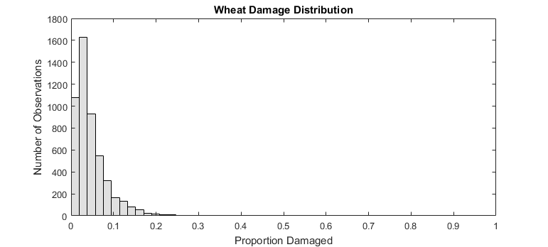
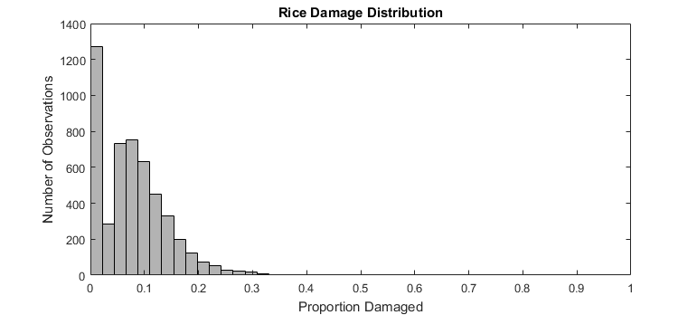
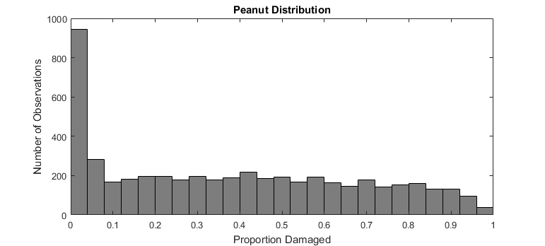
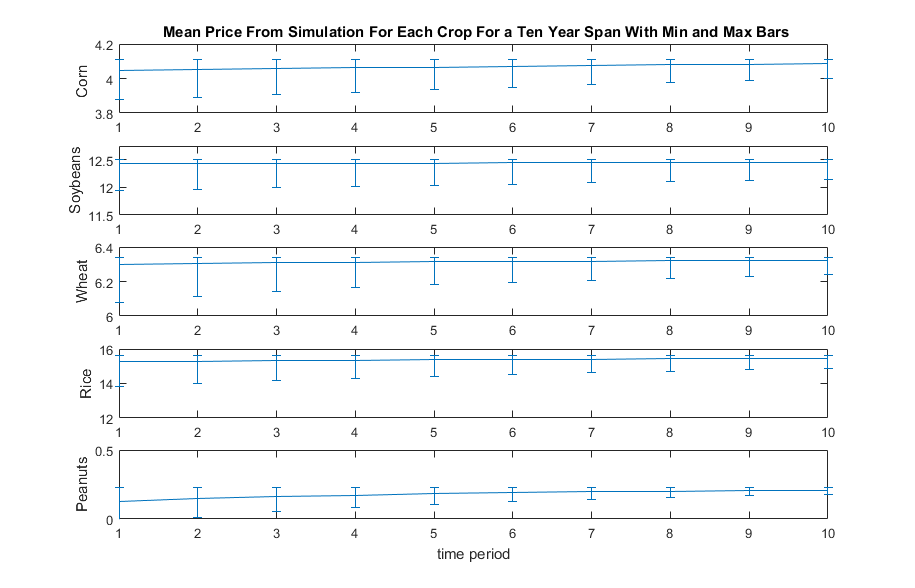
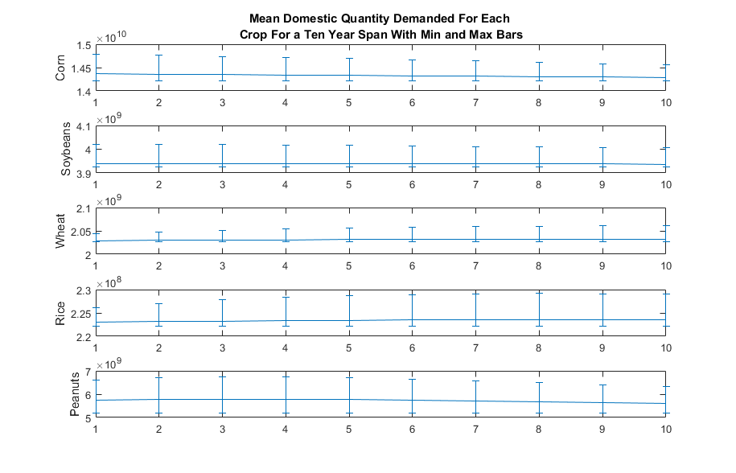

```{r setup, include=FALSE}
knitr::opts_chunk$set(echo = TRUE)
```
One may be concerned that a longer multi-year simulation rather than short-run and long-run should be undertaken. An initial start on a randomized sensitivity analysis on the supply shock provides some hints as to why that may not be a wise use of time. An empirical CDF was used to develop distributions for drawing damage numbers. Results of that simulation are presented here ahead of the MATLAB script. 

The empirical distributions are shown here. Likely if the analysis were to continue different distributions would be used.







The results seem to indicate that the price change may not be statistically different than zero.





```matlab

% clear all
%% SET WD ON MBPRO
% cd('/Users/zejasonh18/Dropbox/CloudComputer/EDM/fsImpact')
%% Set WD on Dell
cd('C:\Users\zejas\Dropbox\CloudComputer\EDM\fsImpact')
%%
load comb.mat
load Elast3.mat
load P0.mat
load Q.mat
load ss.mat
syms EP_corn EP_soy EP_wheat EP_rice EP_peanut
TODAY = strcat('d',datestr(datetime('today'),'ddmmmyyyy'));
iter = comb(1:10000)

reps = length(iter); %1000 -> ~35 min 

%%
B.FRS.c(1:10) = 0.0147;
B.FRS.s(1:10) = 0.005;
B.FRS.w(1:10) = 0.0166;
B.FRS.r(1:10) = 0.0046;
B.FRS.p(1:10) = 0.018;
%% other studies
%Anderson et al (ours)
A(1,1)=B.FRS.c(1);
A(1,2)=B.FRS.s(1);
A(1,3)=B.FRS.w(1);
A(1,4)=B.FRS.r(1);
A(1,5)=B.FRS.p(1);
%Tanger, Guidry, & Nui
A(2,1)=0.0115;
A(2,2)=0.0189;
A(2,3)=0.0296;
A(2,4)=0.138;

%Mengak 2012 pct respondents reporting damage
A(3,1)=0.55;
A(3,2)=0.15;

A(3,5)=0.75;
%Mengak 2015 pct respondents reporting damage
A(4,1)=0.36;
A(4,2)=0.13;
A(4,3)=0.08;%grains
A(4,4)=0.08;%grains
A(4,5)=0.36;
%replace missing with mean of column
m = mean(A,'omitnan');
A(2,5)=m(5);
A(3,3)=m(3);
A(3,4)=m(4);
% Transform the data to the copula scale (unit square) using a kernel
% estimator of the cumulative distribution function.
c = A(:,1);
s = A(:,2);
w = A(:,3);
r = A(:,4);
p = A(:,5);
uc = ksdensity(c,c,'function','cdf');
us = ksdensity(s,s,'function','cdf');
uw = ksdensity(w,w,'function','cdf');
ur = ksdensity(r,r,'function','cdf');
up = ksdensity(p,p,'function','cdf');
% Fit a _t_ copula to the data.
rng default  % For reproducibility
[Rho,nu] = copulafit('t',[uc us uw ur up])
% Generate a random sample from the _t_ copula.
cr = copularnd('t',Rho,nu,reps,'alpha','Clayton');
uc1 = cr(:,1);
us1 = cr(:,2);
uw1 = cr(:,3);
ur1 = cr(:,4);
up1 = cr(:,5);
% Transform the random sample back to the original scale of the data.
c1 = ksdensity(c,uc1,'function','icdf','Support',[0 1]);
s1 = ksdensity(s,us1,'function','icdf','Support',[0 1]);
w1 = ksdensity(w,uw1,'function','icdf','Support',[0 1]);
r1 = ksdensity(r,ur1,'function','icdf','Support',[0 1]);
p1 = ksdensity(p,up1,'function','icdf','Support',[0 1]);
figure;
histogram(D(:,1))
hold on
histogram(D(:,2))
histogram(D(:,3))
histogram(D(:,4))
histogram(D(:,5))


%%
B.AOS.c(1:10) = 0.0;
B.AOS.s(1:10) = 0.0;
B.AOS.w(1:10) = 0.0;
B.AOS.r(1:10) = 0.0;
B.AOS.p(1:10) = 0.0;
%% Substitute in estimated elasticities of demand (marshallian)
% t = 1 & 10 elasticities estimated in R edmDemandElast.Rproj on 11/8/16
Elast3.base.Demand.Corn= linspace(-0.696202, -0.9150616,10);
Elast3.base.Demand.Soy= linspace(-0.53614356, -0.7004875,10);
Elast3.base.Demand.Wheat= linspace(-0.20203276,  -1.065577308, 10);
Elast3.base.Demand.Rice= linspace(-0.15688269, -0.66770675, 10);
Elast3.base.Demand.Peanuts = linspace(-0.23523965, -0.93527167, 10);

%%
distlist = {'base','indepTriangle', 'indepNorm', 'indepUniform'}; %m
commodity = {'Corn', 'Soy', 'Wheat', 'Rice', 'Peanuts'}; %n
Run = {'wedge'};%i
i=1;
region = {'AOS','FRS'}; %j
dest = {'Demand','Exports', 'Imports','Supply'}; %a
cross = {'c','s','w','r','p'}; %c
iter = comb
%%
for n = 1:length(commodity)
    wedge.(commodity{n}).alpha = 0;
    wedge.(commodity{n}).beta = 1;
end
%load wedge.mat
%%load run the linear interp script


%% FIND PRICE CHANGES
% FOR EACH TIME PERIOD SOLVE FOR PRICE CHANGES, WITHIN EACH T LOOP SAVE 

for u = 1:5000
    strcat('iter_',num2str(u))

for t = 1:10
    eqns = [EP_corn   * Elast3.base.Demand.Corn(t)    + (EP_corn   * wedge.Corn.beta)    * (ss.exports_corn   * Elast3.base.Exports.Corn(t)    -  ss.imports_corn   * Elast3.base.Imports.Corn(t))    == ((ss.FRS_corn *    (Elast3.base.Supply.FRS.cc(t) * EP_corn     + Elast3.base.Supply.FRS.cs(t) * EP_soy +    Elast3.base.Supply.FRS.cw(t) * EP_wheat +    Elast3.base.Supply.FRS.cr(t) * EP_rice +   Elast3.base.Supply.FRS.cp(t) * EP_peanut +    c1(u)))    +    (ss.AOS_corn *    (Elast3.base.Supply.AOS.cc(t) * EP_corn + Elast3.base.Supply.AOS.cs(t) * EP_soy + Elast3.base.Supply.AOS.cw(t) * EP_wheat + Elast3.base.Supply.AOS.cr(t) * EP_rice + Elast3.base.Supply.AOS.cp(t) * EP_peanut + B.AOS.c(t)))),
        EP_soy    * Elast3.base.Demand.Soy(t)     + (EP_soy    * wedge.Soy.beta)     * (ss.exports_soy    * Elast3.base.Exports.Soy(t)     -  ss.imports_soy    * Elast3.base.Imports.Soy(t))     == ((ss.FRS_soy *     (Elast3.base.Supply.FRS.sc(t) * EP_corn     + Elast3.base.Supply.FRS.ss(t) * EP_soy +    Elast3.base.Supply.FRS.sw(t) * EP_wheat +    Elast3.base.Supply.FRS.sr(t) * EP_rice +   Elast3.base.Supply.FRS.sp(t) * EP_peanut +    s1(u)))    +    (ss.AOS_soy *     (Elast3.base.Supply.AOS.sc(t) * EP_corn + Elast3.base.Supply.AOS.ss(t) * EP_soy + Elast3.base.Supply.AOS.sw(t) * EP_wheat + Elast3.base.Supply.AOS.sr(t) * EP_rice + Elast3.base.Supply.AOS.sp(t) * EP_peanut + B.AOS.s(t)))),
        EP_wheat  * Elast3.base.Demand.Wheat(t)   + (EP_wheat  * wedge.Wheat.beta)   * (ss.exports_wheat  * Elast3.base.Exports.Wheat(t)   -  ss.imports_wheat  * Elast3.base.Imports.Wheat(t))   == ((ss.FRS_wheat *   (Elast3.base.Supply.FRS.wc(t) * EP_corn     + Elast3.base.Supply.FRS.ws(t) * EP_soy +    Elast3.base.Supply.FRS.ww(t) * EP_wheat +    Elast3.base.Supply.FRS.wr(t) * EP_rice +   Elast3.base.Supply.FRS.wp(t) * EP_peanut +    w1(u)))    +    (ss.AOS_wheat *   (Elast3.base.Supply.AOS.wc(t) * EP_corn + Elast3.base.Supply.AOS.ws(t) * EP_soy + Elast3.base.Supply.AOS.ww(t) * EP_wheat + Elast3.base.Supply.AOS.wr(t) * EP_rice + Elast3.base.Supply.AOS.wp(t) * EP_peanut + B.AOS.w(t)))),
        EP_rice   * Elast3.base.Demand.Rice(t)    + (EP_rice   * wedge.Rice.beta)    * (ss.exports_rice   * Elast3.base.Exports.Rice(t)    -  ss.imports_rice   * Elast3.base.Imports.Rice(t))    == ((ss.FRS_rice *    (Elast3.base.Supply.FRS.rc(t) * EP_corn     + Elast3.base.Supply.FRS.rs(t) * EP_soy +    Elast3.base.Supply.FRS.rw(t) * EP_wheat +    Elast3.base.Supply.FRS.rr(t) * EP_rice +   Elast3.base.Supply.FRS.rp(t) * EP_peanut +    r1(u)))    +    (ss.AOS_rice *    (Elast3.base.Supply.AOS.rc(t) * EP_corn + Elast3.base.Supply.AOS.rs(t) * EP_soy + Elast3.base.Supply.AOS.rw(t) * EP_wheat + Elast3.base.Supply.AOS.rr(t) * EP_rice + Elast3.base.Supply.AOS.rp(t) * EP_peanut + B.AOS.r(t)))),
        EP_peanut * Elast3.base.Demand.Peanuts(t) + (EP_peanut * wedge.Peanuts.beta) * (ss.exports_peanut * Elast3.base.Exports.Peanuts(t) -  ss.imports_peanut * Elast3.base.Imports.Peanuts(t)) == ((ss.FRS_peanuts * (Elast3.base.Supply.FRS.pc(t) * EP_corn     + Elast3.base.Supply.FRS.ps(t) * EP_soy +    Elast3.base.Supply.FRS.pw(t) * EP_wheat +    Elast3.base.Supply.FRS.pr(t) * EP_rice +   Elast3.base.Supply.FRS.pp(t) * EP_peanut +    p1(u)))    +    (ss.AOS_peanuts * (Elast3.base.Supply.AOS.pc(t) * EP_corn + Elast3.base.Supply.AOS.ps(t) * EP_soy + Elast3.base.Supply.AOS.pw(t) * EP_wheat + Elast3.base.Supply.AOS.pr(t) * EP_rice + Elast3.base.Supply.AOS.pp(t) * EP_peanut + B.AOS.p(t))))];
    x = [EP_corn, EP_soy, EP_wheat, EP_rice, EP_peanut];
    [A, b] = equationsToMatrix(eqns, x);
    X = double(linsolve(A,b));
    for n = 1:length(commodity)
        Results.(iter{u}).EP.(commodity{n})(t) =...
            X(n);
        priceChange(u,n,t) = Results.(iter{u}).EP.(commodity{n})(t) ;
    end
end

% FIND QUANTITY CHANGES
% FIND DEMAND, EXPORT AND IMPORT CHANGES
for n = 1:length(commodity)
    for t = 1:10
        Results.(iter{u}).Demand.(commodity{n})(t) = Elast3.base.Demand.(commodity{n})(t) * priceChange(u,n,t);
    end
end

%exports and imports change in response to a price change * wedge
for n = 1:length(commodity)
    for t = 1:10
        Results.(iter{u}).Exports.(commodity{n})(t) = Elast3.base.Exports.(commodity{n})(t) * priceChange(u,n,t) * wedge.(commodity{n}).beta;
    end
end

for n = 1:length(commodity)
    for t = 1:10
        Results.(iter{u}).Imports.(commodity{n})(t) = Elast3.base.Imports.(commodity{n})(t)* priceChange(u,n,t) * wedge.(commodity{n}).beta;
    end
end    

%Find changes in supply quantities
for t = 1:10

    Results.(iter{u}).Supply.AOS.Corn(t)    = Elast3.base.Supply.AOS.cc(t)    *Results.(iter{u}).EP.Corn(t) + Elast3.base.Supply.AOS.cs(t)  * Results.(iter{u}).EP.Soy(t) + Elast3.base.Supply.AOS.cw(t) * Results.(iter{u}).EP.Wheat(t) + Elast3.base.Supply.AOS.cr(t) * Results.(iter{u}).EP.Rice(t) + Elast3.base.Supply.AOS.cp(t) * Results.(iter{u}).EP.Peanuts(t) + B.AOS.c(t);
    Results.(iter{u}).Supply.AOS.Soy(t)     = Elast3.base.Supply.AOS.sc(t)    *Results.(iter{u}).EP.Corn(t) + Elast3.base.Supply.AOS.ss(t)  * Results.(iter{u}).EP.Soy(t) + Elast3.base.Supply.AOS.sw(t) * Results.(iter{u}).EP.Wheat(t) + Elast3.base.Supply.AOS.sr(t) * Results.(iter{u}).EP.Rice(t) + Elast3.base.Supply.AOS.sp(t) * Results.(iter{u}).EP.Peanuts(t) + B.AOS.s(t);
    Results.(iter{u}).Supply.AOS.Wheat(t)   = Elast3.base.Supply.AOS.wc(t)    *Results.(iter{u}).EP.Corn(t) + Elast3.base.Supply.AOS.ws(t)  * Results.(iter{u}).EP.Soy(t) + Elast3.base.Supply.AOS.ww(t) * Results.(iter{u}).EP.Wheat(t) + Elast3.base.Supply.AOS.wr(t) * Results.(iter{u}).EP.Rice(t) + Elast3.base.Supply.AOS.wp(t) * Results.(iter{u}).EP.Peanuts(t) + B.AOS.w(t);
    Results.(iter{u}).Supply.AOS.Rice(t)    = Elast3.base.Supply.AOS.rc(t)    *Results.(iter{u}).EP.Corn(t) + Elast3.base.Supply.AOS.rs(t)  * Results.(iter{u}).EP.Soy(t) + Elast3.base.Supply.AOS.rw(t) * Results.(iter{u}).EP.Wheat(t) + Elast3.base.Supply.AOS.rr(t) * Results.(iter{u}).EP.Rice(t) + Elast3.base.Supply.AOS.rp(t) * Results.(iter{u}).EP.Peanuts(t) + B.AOS.r(t);
    Results.(iter{u}).Supply.AOS.Peanuts(t) = Elast3.base.Supply.AOS.pc(t)    *Results.(iter{u}).EP.Corn(t) + Elast3.base.Supply.AOS.ps(t)  * Results.(iter{u}).EP.Soy(t) + Elast3.base.Supply.AOS.pw(t) * Results.(iter{u}).EP.Wheat(t) + Elast3.base.Supply.AOS.pr(t) * Results.(iter{u}).EP.Rice(t) + Elast3.base.Supply.AOS.pp(t) * Results.(iter{u}).EP.Peanuts(t) + B.AOS.p(t);
    
    Results.(iter{u}).Supply.FRS.Corn(t)    = Elast3.base.Supply.FRS.cc(t)     *Results.(iter{u}).EP.Corn(t) + Elast3.base.Supply.FRS.cs(t)   * Results.(iter{u}).EP.Soy(t) + Elast3.base.Supply.FRS.cw(t)  * Results.(iter{u}).EP.Wheat(t) + Elast3.base.Supply.FRS.cr(t)  * Results.(iter{u}).EP.Rice(t) + Elast3.base.Supply.FRS.cp(t)  * Results.(iter{u}).EP.Peanuts(t) + c1(u);
    Results.(iter{u}).Supply.FRS.Soy(t)     = Elast3.base.Supply.FRS.sc(t)     *Results.(iter{u}).EP.Corn(t) + Elast3.base.Supply.FRS.ss(t)   * Results.(iter{u}).EP.Soy(t) + Elast3.base.Supply.FRS.sw(t)  * Results.(iter{u}).EP.Wheat(t) + Elast3.base.Supply.FRS.sr(t)  * Results.(iter{u}).EP.Rice(t) + Elast3.base.Supply.FRS.sp(t)  * Results.(iter{u}).EP.Peanuts(t) + s1(u);
    Results.(iter{u}).Supply.FRS.Wheat(t)   = Elast3.base.Supply.FRS.wc(t)     *Results.(iter{u}).EP.Corn(t) + Elast3.base.Supply.FRS.ws(t)   * Results.(iter{u}).EP.Soy(t) + Elast3.base.Supply.FRS.ww(t)  * Results.(iter{u}).EP.Wheat(t) + Elast3.base.Supply.FRS.wr(t)  * Results.(iter{u}).EP.Rice(t) + Elast3.base.Supply.FRS.wp(t)  * Results.(iter{u}).EP.Peanuts(t) + w1(u);
    Results.(iter{u}).Supply.FRS.Rice(t)    = Elast3.base.Supply.FRS.rc(t)     *Results.(iter{u}).EP.Corn(t) + Elast3.base.Supply.FRS.rs(t)   * Results.(iter{u}).EP.Soy(t) + Elast3.base.Supply.FRS.rw(t)  * Results.(iter{u}).EP.Wheat(t) + Elast3.base.Supply.FRS.rr(t)  * Results.(iter{u}).EP.Rice(t) + Elast3.base.Supply.FRS.rp(t)  * Results.(iter{u}).EP.Peanuts(t) + r1(u);
    Results.(iter{u}).Supply.FRS.Peanuts(t) = Elast3.base.Supply.FRS.pc(t)     *Results.(iter{u}).EP.Corn(t) + Elast3.base.Supply.FRS.ps(t)   * Results.(iter{u}).EP.Soy(t) + Elast3.base.Supply.FRS.pw(t)  * Results.(iter{u}).EP.Wheat(t) + Elast3.base.Supply.FRS.pr(t)  * Results.(iter{u}).EP.Rice(t) + Elast3.base.Supply.FRS.pp(t)  * Results.(iter{u}).EP.Peanuts(t) + p1(u);
end


 % FIND CHANGES IN PRODUCER AND CONSUMER SURPLUS

 % Build vector of prices for each commodity for reference
for n = 1:length(commodity)
    for t = 1:10
        R.(iter{u}).(commodity{n}).P(t) = P0.(lower(commodity{n}(1))) * (1 + Results.(iter{u}).EP.(commodity{n})(t)); 
        
        pricetable(u,n,t)= R.(iter{u}).(commodity{n}).P(t);
        
    end
end

 % Build vector of quantities for each commodity for reference
for n = 1:length(commodity)
    for t = 1:10
        R.(iter{u}).(commodity{n}).qd(t) = Q.(strcat((lower(commodity{n}(1))),'_','d','_0')) * (1 + Results.(iter{u}).Demand.(commodity{n})(t)); 
        qdtable(u,n,t)= R.(iter{u}).(commodity{n}).qd(t);
    end
end

% Build vector of elasticities for each commodity for reference
for n = 1:length(commodity)
    for t = 1:10
        R.(iter{u}).(commodity{n}).elast(t) = Elast3.base.Demand.(commodity{n})(t); 
    end
end


% find the change in CS
for n = 1:length(commodity)
    for t = 1:10
        if t == 1
            Pd = P0.(lower(commodity{n}(1)));
            qd = Q.(strcat((lower(commodity{n}(1))),'_','d','_0'));
            elast = R.(iter{u}).(commodity{n}).elast(t);
            sloped00 = round((1 / elast) * (Pd/qd),2,'significant');
            yinterceptd00 = Pd - sloped00*(qd);
            CS0 = (yinterceptd00 - Pd) * qd * 0.5;
            R.(iter{u}).(commodity{n}).CS0(t) = CS0;
            
            
            Pdt = R.(iter{u}).(commodity{n}).P(t);
            qdt = R.(iter{u}).(commodity{n}).qd(t);
            yintercept0001 = Pdt - sloped00 * (qdt);
            CS1 = (yintercept0001 - Pdt) * qdt * 0.5;
            R.(iter{u}).(commodity{n}).CS1(t) = CS1;
            Results.(iter{u}).chg_CS.(commodity{n})(t) = CS1 - CS0;
            R.(iter{u}).(commodity{n}).chg_CS(t) = Results.(iter{u}).chg_CS.(commodity{n})(t);
            chgCStable(u,n,t) = R.(iter{u}).(commodity{n}).chg_CS(t);
        else
            t_minus_1 = t - 1;
            Pd = R.(iter{u}).(commodity{n}).P(t_minus_1);
            qd = R.(iter{u}).(commodity{n}).qd(t_minus_1);
            elast = R.(iter{u}).(commodity{n}).elast(t);
            sloped00 = round((1 / elast) * (Pd/qd),2,'significant');
            yinterceptd00 = Pd - sloped00*(qd);
            CS0 = (yinterceptd00 - Pd) * qd * 0.5;
            R.(iter{u}).(commodity{n}).CS0(t) = CS0;
            
            Pdt = R.(iter{u}).(commodity{n}).P(t);
            qdt = R.(iter{u}).(commodity{n}).qd(t);
            yintercept0001 = Pdt - sloped00 * (qdt);
            CS1 = (yintercept0001 - Pdt) * qdt * 0.5;
            R.(iter{u}).(commodity{n}).CS1(t) = CS1;
            Results.(iter{u}).chg_CS.(commodity{n})(t) = CS1 - CS0;
            R.(iter{u}).(commodity{n}).chg_CS(t) = Results.(iter{u}).chg_CS.(commodity{n})(t);
            chgCStable(u,n,t) = R.(iter{u}).(commodity{n}).chg_CS(t);
        end
    end
end


% Change in Producer Surplus
for j = 1:length(region)
    for n = 1:length(commodity)
        for t = 1:10
          R.(iter{u}).(commodity{n}).supply.(region{j})(t) = (Q.(strcat((lower(commodity{n}(1))),'_',(region{j}),'_0')))* (1+Results.(iter{u}).Supply.(region{j}).(commodity{n})(t));
          qSupplied(u,n,t,j) = R.(iter{u}).(commodity{n}).supply.(region{j})(t);
        end
    end
end

for j = 1:length(region)
    for n = 1:length(commodity)
        for t = 1:10
            if t == 1
                P00 = P0.(lower(commodity{n}(1))); % set P naught
                q00 = (Q.(strcat((lower(commodity{n}(1))),'_',(region{j}),'_0'))); % set Q naught
                elast00 = Elast3.base.Supply.(region{j}).(strcat((lower(commodity{n}(1))),(lower(commodity{n}(1)))))(t);
                slope00 = (1/elast00)*(P00/q00);
                yintercept = P00 - slope00*(q00);
                if yintercept < 0
                    qint0 = -yintercept/slope00;
                    %then it is the triangle from the x intercept
                    %and the box between p',q=0 and
                    %find triangle portion
                    triangle = (q00 - qint0)*P00*0.5;
                    %rectangle portion
                    rectangle = qint0 * P00;
                    PS0 = triangle + rectangle;
                else %if y intercept >= 0 this is easy, find area to price axis
                    PS0 = (P00 - yintercept) * q00 * 0.5;
                end
                Results.(iter{u}).PS0.(region{j}).(commodity{n}) = PS0;
                P01 = R.(iter{u}).(commodity{n}).P(t);
                q01 = R.(iter{u}).(commodity{n}).supply.(region{j})(t);
                elast01 = Elast3.base.Supply.(region{j}).(strcat((lower(commodity{n}(1))),(lower(commodity{n}(1)))))(t);
                yintercept1 = P01 - slope00*(q01);
                if yintercept1 < 0
                    qint1 = -yintercept1/slope00;
                    %find triangle portion
                    triangle1 = (q01 - qint1)*P01*0.5;
                    %rectangle portion
                    rectangle1 = qint1 * P01;
                    PS1 = triangle1 + rectangle1;
                else
                    PS1 = (P01 - yintercept1) * q01 * 0.5;
                end
                Results.(iter{u}).PSNew.(region{j}).(commodity{n})(t) = PS1;
                Results.(iter{u}).ChgPS.(region{j}).(commodity{n})(t) = ...
                    Results.(iter{u}).PSNew.(region{j}).(commodity{n})(t) - ...
                    Results.(iter{u}).PS0.(region{j}).(commodity{n});
                R.(iter{u}).(commodity{n}).chgPS.(region{j})(t)= Results.(iter{u}).ChgPS.(region{j}).(commodity{n})(t);
                chgPS(u,n,t,j) = R.(iter{u}).(commodity{n}).chgPS.(region{j})(t);
            else
                t_minus_1 = t - 1;

                P00 = R.(iter{u}).(commodity{n}).P(t_minus_1); % set P naught
                q00 = R.(iter{u}).(commodity{n}).supply.(region{j})(t_minus_1) ;% set Q naught
                elast00 = Elast3.base.Supply.(region{j}).(strcat((lower(commodity{n}(1))),(lower(commodity{n}(1)))))(t);
                slope00 = (1/elast00)*(P00/q00);
                yintercept = P00 - slope00*(q00);
                if yintercept < 0
                    qint0 = -yintercept/slope00;
                    %then it is the triangle from the x intercept
                    %and the box between p',q=0 and
                    %find triangle portion
                    triangle = (q00 - qint0)*P00*0.5;
                    %rectangle portion
                    rectangle = qint0 * P00;
                    PS0 = triangle + rectangle;
                else %if y intercept >= 0 this is easy, find area to price axis
                    PS0 = (P00 - yintercept) * q00 * 0.5;
                end
                Results.(iter{u}).PS0.(region{j}).(commodity{n}) = PS0;
                P01 = R.(iter{u}).(commodity{n}).P(t);
                q01 = R.(iter{u}).(commodity{n}).supply.(region{j})(t);
                elast01 = Elast3.base.Supply.(region{j}).(strcat((lower(commodity{n}(1))),(lower(commodity{n}(1)))))(t);
                yintercept1 = P01 - slope00*(q01);
                if yintercept1 < 0
                    qint1 = -yintercept1/slope00;
                    %find triangle portion
                    triangle1 = (q01 - qint1)*P01*0.5;
                    %rectangle portion
                    rectangle1 = qint1 * P01;
                    PS1 = triangle1 + rectangle1;
                else
                    PS1 = (P01 - yintercept1) * q01 * 0.5;
                end
                Results.(iter{u}).PSNew.(region{j}).(commodity{n})(t) = PS1;
                Results.(iter{u}).ChgPS.(region{j}).(commodity{n})(t) = ...
                    Results.(iter{u}).PSNew.(region{j}).(commodity{n})(t) - ...
                    Results.(iter{u}).PS0.(region{j}).(commodity{n});
                R.(iter{u}).(commodity{n}).chgPS.(region{j})(t)= Results.(iter{u}).ChgPS.(region{j}).(commodity{n})(t);
                chgPS(u,n,t,j) = R.(iter{u}).(commodity{n}).chgPS.(region{j})(t);
            end
        end
    end
end

end
%%
stat = {'mean','max','min'}
 s = 3
    for t = 1:10
        for n = 1:length(commodity)
           pchg(n,t,s) = min(pricetable(:,n,t))
        end
    end


figure
errorbar(1:10,pchg(1,:,1),pchg(1,:,1)-pchg(1,:,3),pchg(1,:,2)-pchg(1,:,1))
ax1 = gca;
figure
errorbar(1:10,pchg(2,:,1),pchg(2,:,1)-pchg(2,:,3),pchg(2,:,2)-pchg(2,:,1))
ax2 = gca;
figure
errorbar(1:10,pchg(3,:,1),pchg(3,:,1)-pchg(3,:,3),pchg(3,:,2)-pchg(3,:,1))
ax3 = gca;
figure
errorbar(1:10,pchg(4,:,1),pchg(4,:,1)-pchg(4,:,3),pchg(4,:,2)-pchg(4,:,1))
ax4 = gca;
figure
errorbar(1:10,pchg(5,:,1),pchg(5,:,1)-pchg(5,:,3),pchg(5,:,2)-pchg(5,:,1))
ax5 = gca;


f3 = figure;
ax1_copy = copyobj(ax1,f3);
subplot(5,1,1,ax1_copy)

copies = copyobj(ax2,f3);
ax2_copy = copies(1);
subplot(5,1,2,ax2_copy)

copies = copyobj(ax3,f3);
ax3_copy = copies(1);
subplot(5,1,3,ax3_copy)

copies = copyobj(ax4,f3);
ax4_copy = copies(1);
subplot(5,1,4,ax4_copy)

copies = copyobj(ax5,f3);
ax5_copy = copies(1);
subplot(5,1,5,ax5_copy)

%%
stat = {'mean','max','min'}
 s = 1
    for t = 1:10
        for n = 1:length(commodity)
           qchg(n,t,s) = mean(qdtable(:,n,t))
        end
    end
 s = 2
    for t = 1:10
        for n = 1:length(commodity)
           qchg(n,t,s) = max(qdtable(:,n,t))
        end
    end
     s = 3
    for t = 1:10
        for n = 1:length(commodity)
           qchg(n,t,s) = min(qdtable(:,n,t))
        end
    end

figure
errorbar(1:10,qchg(1,:,1),qchg(1,:,1)-qchg(1,:,3),qchg(1,:,2)-qchg(1,:,1))
ax1 = gca;
figure
errorbar(1:10,qchg(2,:,1),qchg(2,:,1)-qchg(2,:,3),qchg(2,:,2)-qchg(2,:,1))
ax2 = gca;
figure
errorbar(1:10,qchg(3,:,1),qchg(3,:,1)-qchg(3,:,3),qchg(3,:,2)-qchg(3,:,1))
ax3 = gca;
figure
errorbar(1:10,qchg(4,:,1),qchg(4,:,1)-qchg(4,:,3),qchg(4,:,2)-qchg(4,:,1))
ax4 = gca;
figure
errorbar(1:10,qchg(5,:,1),qchg(5,:,1)-qchg(5,:,3),qchg(5,:,2)-qchg(5,:,1))
ax5 = gca;


f3 = figure;
ax1_copy = copyobj(ax1,f3);
subplot(5,1,1,ax1_copy)

copies = copyobj(ax2,f3);
ax2_copy = copies(1);
subplot(5,1,2,ax2_copy)

copies = copyobj(ax3,f3);
ax3_copy = copies(1);
subplot(5,1,3,ax3_copy)

copies = copyobj(ax4,f3);
ax4_copy = copies(1);
subplot(5,1,4,ax4_copy)

copies = copyobj(ax5,f3);
ax5_copy = copies(1);
subplot(5,1,5,ax5_copy)
%%(Q.(strcat((lower(commodity{n}(1))),'_',(region{j}),'_0')))
for n = 1:length(commodity)
    for t = 1:10
        if t == 1
            figure
            histogram(chgCStable(:,(n),(t)))
            ax = gca;
            strcat('f',(n)) = figure;
            copy = copyobj(ax,strcat('f',(n)));
            subplot(10,1,(t),copy)
        else
            figure
            histogram(chgCStable(:,(n),(t)))
            ax = gca;
            copies = copyobj(ax,strcat('f',(n)));
            copy = copies(1);
            subplot(10,1,(t),copy) 
        end
    end    
end
```